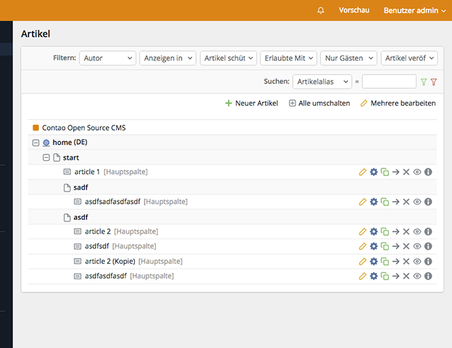
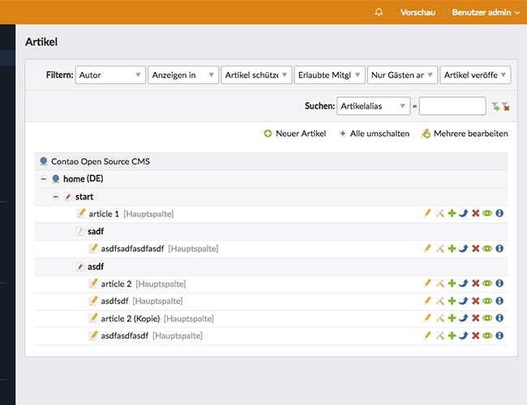

# facelift – Backend-Theme-Alternative für Contao 4

"facelift" ist eine Backend-Theme-Alternative für Contao 4.

## Enthält:

* schlichtere Icons, basierend auf den https://feathericons.com
* die besser lesbare "Open Sans" anstatt der "Lato"
* diverse Änderungen am Gesamtbild

## Installation:

### Schritt 1  

#### Via Composer

```
composer require georgpreissl/facelift
```

#### Manuell

Lade das Theme herunter und verschiebe den Ordner `src/Resources/contao/facelift` in folgendes Verzeichnis deiner Contao-Installation:
my-contao-installation/system/themes/

### Schritt 2

Wähle in Contao-Backend bei den Profil-Einstellungen des angemeldeten Benutzers das Theme "facelift" aus. 
Die Profil-Einstellungen sind über das Dropdown-Menü rechts-oben erreichbar.  

<br>
<br>

  
Facelift-Theme

<br>
<br>

  
Standard-Theme